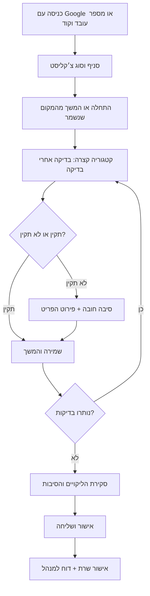

# Hebrew employee checklists and owner builder — implementation plan

Date: 2026-10-07. Status: first production slice implemented locally; not deployed. Read `docs/STAFF_CHECKLISTS.md` for the implemented contract and release order, `CODEBASE_FINDINGS.md` for inspected facts, and `CHECKLIST_CONTENT_HE.md` for the complete initial content.

## 1. Product outcome and boundaries

An employee opens Sarcafe, signs in with Google or employee number + six-digit code, and completes a branch-specific opening, handover, or closing checklist. Everything in this flow is Hebrew, right-to-left, and understandable without training. An owner can create forms for any branch, organize categories, edit instructions and inventory lists, control order and required steps, preview the actual employee flow, and publish revisions without changing historical reports.

Givat Haviva is the first rollout. Maor has closing cash target 400 NIS versus 500 NIS at Givat Haviva, and a cushion/tent step unique to Maor. Neither branch name nor cash target belongs in component logic.

The checklist records an employee's declaration that they clocked in/out at the till. It does not implement a new attendance system or switch physical machines. Confirming a defect does not mean it is repaired or approved by a manager.

## 2. Decisions and assumptions

| Topic | Proposed default | Status |
|---|---|---|
| Employee UID | Existing human employee number (`employee_no`), manually matched to HYP, + six-digit code | User confirmed. No automatic HYP integration was requested. Identifier alone is never a credential. |
| Google activation | NOT required. Employee can begin with number/code, then optionally add/link email or keep using number/code | User confirmed. This supersedes the old first-Google requirement. |
| Manager reports | Dedicated Sarcafe checklist inbox with prominent owner dashboard gap alert/count | User confirmed for now. No push/WhatsApp integration in initial scope. |
| Checklist managers | Owner everywhere; general manager in assigned branch scope; explicit owner delegation if needed | Proposed capability, distinct from scheduling delegation. |
| Code managers | Owner or explicitly authorized full-session manager, only eligible staff in allowed scope | Never infer permission from being a shift colleague. Owners control delegation. |
| Employee completion | One accountable employee per run; handover can record the receiving employee | No mandatory second signature in initial default; configurable later if required. |
| Shift link | Link scheduled shift when suitable; allow unscheduled run with business date and occurrence | A roster mismatch must not prevent work. Preserve run evidence if a scheduled shift is deleted. |
| Publishing | Draft saves automatically; deliberate `פרסום לעובדים` makes it live | Editing never mutates a currently running/submitted checklist. |
| Skipping | Required by default; optional or not-applicable only when configured | Every defect and configured skip requires a reason. Do not offer universal skip. |
| Machine problems | Report and allow reasoned progress unless owner marks step as blocking | Never pretend a manager's verbal instruction makes equipment healthy. |

User confirmed owner creates an initially nameless employee record, then fills first/last name, nickname, optional email/phone, and employee number matching HYP. Draft records must be saveable before all fields are filled; activation and login readiness are distinct. Builder/manager-policy details not explicitly confirmed remain proposals.

## 3. Employee journey

### Entry and home

- Direct route proposed: `/staff/checklists`. Branch-scoped employees see their branch immediately. All-branch staff choose from authorized branches and remember selection. Never preselect a branch outside their scope.
- Three clear actions: `פתיחת משמרת`, `החלפת משמרת`, `סגירת משמרת`. A paused run shows `המשך הצ׳קליסט` with progress and last save.
- Show employee name, branch and type before starting. A change-user action signs out and clears current-user UI/caches on shared devices. Do not cache passcodes.
- Deep-link login preserves the checklist destination for both Google and quick login. Use an allowlist of safe internal destinations in middleware, login, callback, and quick-login response. Keep existing POS entry behavior when POS was the requested destination.
- First code login works without Google or email once owner has enabled number/code access. Show setup readiness in owner panel. In employee profile offer `הוספת אימייל לכניסה עם Google`; saving an email is contact/pending-link data, not verified ownership. UID/code remains usable afterwards.

### Steps and inputs

- Categories follow physical work order; opening begins with clock-in and machines so heating happens during inventory checks. Each category presents short, sequential item cards, rather than the whole form.
- A large current instruction, optional short help, progress such as `בדיקה 3 מתוך 8`, and persistent bottom action within iOS safe areas. Back/edit always preserves answers. Avoid forced animations and swipes as the only navigation.
- Inventory/machine/cleanliness status uses visible `תקין` / `לא תקין` buttons, with text/icon/colour and selected semantics. No defaults or bulk "all good" that can bypass inspection.
- On `לא תקין`, show `מה לא תקין?` and `מה הסיבה?` next to the failed item. Require trimmed non-empty explanation before advancing. Owner may provide reason suggestions, but no reason is silently filled.
- Examples: `מכונת הקרח לא עובדת — דני אמר לא להפעיל בינתיים`; `אין אייס במכונה — מחר מנקים את המכונה`. Preserve original text and author/time.
- Split multi-product checks into small per-product statuses inside the category: milk types, cups, pizza sizes, shake varieties. A grouped summary must not hide which product is missing. Owners can add/reorder/remove product types, including shake types.
- Actions such as clock-in or locking use `בוצע` and `לא בוצע`; the latter also requires explanation. Machine shutdown remains a machine status/action with failure reason.
- Count fields only where useful: trays, spare sleeves, cash. Defaults express minimum/target instructions; don't claim measured quantities if employee only attested status. Cash count captures actual amount, target and discrepancy reason when unequal.
- No photo/video requirement by default. Interpret user text `ווידאו מלאי` as inventory verification (`וידוא`), not recording a video. Keep this interpretation visible for correction.
- Opening cash declaration is an acknowledgement; no invented opening float. Closing includes editable target amount and discrepancy reason.

### Defect review and submission

- Review lists every defect by category/product, reason, and any count difference. Allow return to edit. Require `אני מאשר/ת שכל הליקויים והסיבות שצוינו נכונים` when defects exist; require completion attestation even when all checks passed.
- Server rejects submission with missing required answers/reasons, unresolved configured blockers, invalid counts, or stale run revision. Client UI checks are convenience, not enforcement.
- Server commits final answers, immutable submission, issue records and manager inbox events in one transaction. Same idempotency key returns same result; double tap/retry never duplicates a report.
- Employee success wording `הצ׳קליסט נשלח` only after server receipt. If offline, show `נשמר במכשיר — יישלח כשיחזור החיבור`; do not say manager received it. Show pending recovery on reopening.
- Cleaning or stock defects must create manager reports. Machine and other failures also remain visible in the report; configurable urgency/routing must not suppress required defect recording.
- "Reported" means inbox row exists. "Read" means manager opened/acknowledged it; push delivery alone is neither read nor resolution.

## 4. Owner builder and manager workspace

Route proposed `/owner/checklists`, branch selector, and Hebrew views `טפסים · דיווחים · היסטוריה · הגדרות`.

### Friendly builder

1. `יצירת צ׳קליסט`: choose branch, name, and opening/handover/closing/custom purpose. Offer `מתבנית מוכנה`, `העתקה מסניף אחר`, `טופס חדש`.
2. Category outline shows readable headings and counts. `הוספת קטגוריה`, rename, duplicate, remove; reorder via `הזזה למעלה/למטה` as well as optional drag. Drag must never be required on a phone.
3. `הוספת בדיקה` offers plain-language types: `משימה לביצוע`, `בדיקה תקין / לא תקין`, `רשימת מוצרים`, `כמות או ספירה`, `הצהרה`. Editor fields: instruction, short help, required?, reason suggestions, counts/targets, report category/urgency, and blocking behavior. Advanced settings collapsed.
4. Product list editor lets owner type shake/milk/cup types and quantities, no JSON or schema terminology. Multi-product template expands to per-product checks with stable IDs.
5. Set flow order, category boundaries, required prerequisites, branch-specific items and targets using explicit controls. Initial version supports the defined types/order/conditions, not arbitrary executable rules. Owner control should be broad within a understandable, validated model.
6. `תצוגת עובד`: run through draft with sample answers; preview never writes operational reports or completion stats. Keep preview visibly labeled `תצוגה מקדימה`.
7. `פרסום לעובדים`: show what changed and branch affected; check missing labels, empty categories, duplicate IDs, invalid numbers, invalid prerequisites/cycles, unsafe removal of mandatory-reason behavior. Existing runs stay on their captured version; new runs use the new revision.

Draft autosaves with `שומר…` / `נשמר` / `לא נשמר — נסו שוב`. Support undo for local removal and explicit confirmation for archive. Archive hides template from new runs while preserving all evidence. Copy creates an independent draft; cash targets and branch-specific steps require review rather than blind duplication.

### Manager reports

- Filter by branch, date, type, employee, incomplete/submitted and issues. Paginate history; do not download everyone's answers on first paint.
- Inbox rows show exact product/problem, reason, reporter, branch and time; link to immutable submission. States `חדש`, `בטיפול`, `טופל` with accountable manager and note. Reopening is audited.
- Summary distinguishes missing inventory, cleanliness, machine faults, cash discrepancies, and uncompleted work. Show missing submissions only when an expected occurrence has been configured; do not invent overdue shifts from any absence of data.
- General manager sees only permitted branches; all-branch owner sees all. Code management separate from reporting so a report reviewer does not gain credential authority.
- First release uses only in-app reports, as user confirmed. Add a prominent owner dashboard signal `יש N ליקויים פתוחים` with branch/severity breakdown, an unread count in checklist navigation, and direct inbox link. Include missing inventory/cleanliness clearly even after the report was read; open-gap count and unread count are distinct. Future push/WhatsApp is separate scope.

## 5. Quick-code changes (existing system)

1. Fix session provenance/revocation first. Extend quick-session registry with status/expiry/revocation, keep quick provenance until underlying session/tokens cannot be used, and deny revoked/expired sessions. Code rotation/revocation updates status rather than erasing provenance. Cleanup must never upgrade a token to full trust. Validate session existence where strict immediate revocation is required. Review mint-before-registry race/partial failure as well.
2. Centralize staff identity plus credential assurance in a staff auth layer independent of POS. Keep server staff lookup and fail-closed classification; update owner/schedule/POS guards and middleware consistently. Require active staff and branch eligibility on every checklist request.
3. Preserve full-session code changes. Quick login cannot edit own code, manager settings, builder, reports for other staff, or delegate capabilities, even if account belongs to owner.
4. Add `set` action with six-digit passcode for owner/authorized manager; keep `generate` and `clear`. Manual code rejects known weak patterns and shows a simple reason. Atomic save/renumber or make sequencing explicit to avoid half-success.
5. Employee settings available directly from staff/checklist profile, using shared UI extracted from POS code sheet. Add random generation for employee as well as manual selection. Owner/manager UI options: `בחירת קוד`, `יצירת קוד אקראי`, `ביטול הקוד`. For UID-only employees changing their own code requires current-code re-entry/recent verification, since Google is optional. An existing quick session alone cannot change the secret. Google-linked users may use full Google reauthentication. Keep ordinary credential changes unavailable to stale/stolen shared-device sessions.
6. Generate server-side with cryptographic random source; preserve leading zeros; only hash stored. Generated code shown once in a no-store response, never in URL/local storage/audit/logs. Lost code means replace, not retrieve. Keep employee number visible as identifier.
7. Explicit code-management capability: OP, or granted manager in matching staff branch. Deny targets with higher privilege/all-branch scope unless actor is OP. Staff page remains owner-only unless intentionally introducing a limited manager access screen/API; do not expose owner staff CRUD to fulfill code management.
8. Authentication rate limiter must fail closed on database errors, independent from operational fail-open rate-limit policy. Preserve generic login errors, timing controls, same-origin parsing, limits per identifier and IP. No pin-bearing telemetry.
9. **UID-only onboarding is required**, not optional. Add a saveable owner staff draft without first name/nickname/email; assign a stable internal staff UUID. Internal placeholder handles must be unique and clearly temporary, not shown as a real person's name. Before activating checklist login require branch eligibility, employee number and a code; owner can then fill personal details. Retain existing staff numbers unless owner explicitly edits to match HYP; enforce uniqueness and give a plain conflict error. Review whether the current 1–99999 range covers actual HYP numbers; preserve leading-zero display only if HYP uses it.

### UID-first identity design

The current mint path requires a linked Auth user/email and cannot serve nameless/no-email staff. Do not attempt to fix this just by removing the `auth_user_id` check.

Recommended design for this requirement: a first-party opaque employee session, created after successful server PIN verification. Store only a hash of a cryptographically random session token in a service-only `staff_employee_sessions` table, with staff ID, issued/expiry/revoked time and assurance. Set a Secure, HttpOnly, SameSite cookie. This gives no-email staff a stable identity without inventing email addresses or provisioning a new auth provider.

- Shared identity resolver recognizes either validated Google/Supabase session linked to active staff, or valid opaque employee session. Staff actor is always `staff.id`; both authenticate the same person. If both cookies identify different people, require explicit user switch rather than silently attributing actions. Store high-entropy tokens only as hashes; enforce expiry/revocation and staff active status server-side. Bind recent PIN re-verification to that session, action and short expiry, never a client-supplied boolean.
- Number/code sessions remain employee-level even for an owner account. Middleware and ALL floor/owner APIs must agree on this identity/assurance model. Refactoring only new checklist APIs would strand UID-first users outside staff navigation.
- New opaque employee sessions do not authorize Supabase browser Data API/Realtime. Checklist service APIs work normally. Existing POS/scheduling features relying on browser Supabase sessions need an explicit compatibility plan (guarded API polling or narrowly authenticated channels) before claiming UID-first parity across those features. Do not open RLS or embed service-role keys to make a channel work. Update login-readiness/`hasLogin`/`has_google` derivations, staff invitation claiming, deactivation/reactivation and deletion-history predicates: an Auth UUID alone does not prove Google linkage, and a no-email employee may now log in. Verify nickname confirmation stays a POS-specific step, not a checklist prerequisite.
- Preserve existing linked-user quick-session behavior until safely migrated; existing cookies must not lose assurance classification. The migration can issue opaque sessions to both linked and unlinked staff, with one consistent floor identity path.
- To add Google later: authenticated employee enters optional email, then explicitly completes Google OAuth; callback must verify provider/email ownership and bind to that SAME staff UUID using a short-lived server-stored link intent. Do not match/link purely from submitted email. Conflicting existing Auth/staff links require owner-assisted resolution; never merge history silently.
- An employee adding a contact email is a permitted narrow self-service action from number/code access. Changing an already verified login email is a separate authenticated/recovery workflow, not an arbitrary profile field edit. Keep contact email and verified login state distinct in UI/data.
- If only Google was added, email sign-in means the existing Google OAuth flow. Plain-email OTP/magic-link login is not confirmed by the user and must not be silently added.
- Owner can manually choose or randomly generate code before any Google login. Employee can keep UID/code forever, add email later, or use both. Account recovery is owner reset; log actor/target but never secret.
- Evaluate Supabase-supported identity/session alternatives before implementation against current docs; document an ADR if choosing a different design. Acceptance remains no Google/email prerequisite, same staff history, no weak-session privilege escalation.

## 6. Data architecture (proposed; schema names can be adjusted before coding)

| Table | Purpose / essential fields |
|---|---|
| `checklist_settings` | Per branch: enabled, explicit manager/delegate IDs, notification recipients, default policy. |
| `checklist_templates` | Branch, name, purpose, archived flag, draft JSON, draft revision, published version ID. |
| `checklist_template_versions` | Immutable validated definition, version number, published actor/time. Stable category/item/product IDs and settings captured. |
| `checklist_runs` | Branch, template/version, actor staff, optional scheduled shift, business date, occurrence, in-progress/submitted/abandoned, revision, started/submitted time, attestation, client key. |
| `checklist_answers` | Run/item/product keys, status, reason, actual value, server timestamp, actor, answer revision. |
| `checklist_issues` | Run/item, immutable reported problem/reason snapshot, category/severity, current resolution state, manager/note/timestamps. |
| `checklist_notifications` | Authorized recipient, event/run/issue, Hebrew title/body, read time, deduplication key. |
| `checklist_audit` | Branch, actor, operation, target, before/after or safe summary, time. No codes or secrets. |
| `staff_employee_sessions` | Service-only opaque token hash, staff ID, assurance, issued/expiry/revoked time; supports number/code before email/Google exists. |

Versioned definitions as JSON fit the existing draft/published menu pattern; normalized runs/answers/issues fit querying and auditing. Validate definition via strict Zod and SQL checks at boundaries. Submitted answer corrections are amendments with reason/actor, never silent overwrites.

- Unique template version number; answer key unique per run/item/product. Run start/submission idempotency keys distinct. Optional "one run per occurrence per employee/template" index applies only after defining occurrence semantics; multiple handovers/day must remain possible.
- Index run history `(branch_id, business_date, submitted_at)`, own-run lookup `(staff_id, status)`, issues `(branch_id, status, created_at)`, unread recipient `(staff_id, read_at)`; foreign-key indexes as needed. Include only needed fields in responses.
- Branch date uses configured `Asia/Jerusalem`; UTC for stored timestamps. Explicit overnight shift business date; no device-local assumptions.
- Every exposed table RLS enabled. Prefer service-only writes through guarded APIs/transaction RPCs; explicit grants. If browser reads/Realtime are added, policies must validate staff scope, ownership and quick-session state, not just `authenticated`.
- Browser may not submit actor, branch authority, published status, completion timestamp, manager identity, or arbitrary report state. Server derives them; SQL rechecks actor/branch permission where invoked with service role.
- Service RPCs have locked search_path and explicit execute revokes for PUBLIC/anon/authenticated; do not inherit accidentally exposed SECURITY DEFINER behavior. Scope data to branch/run and derive issue payload from validated saved answers.
- Staff/run evidence remains after deactivation. Use restrict/null behavior appropriate to history; archiving a form never deletes reports. Shift linkage can become null, retaining captured label/date/time.
- Publish under template row lock with expected draft revision; concurrent editor gets a clear conflict and reload option. Submit under run lock with expected revision; foreign/stale answers are rejected.

## 7. API and file plan

New domain under `src/lib/checklists/`: types, strict schemas, Hebrew messages, seed definitions, completion validator, access predicates, server guards/state/write helpers; pure validation separate from React/DB.

New UI under `src/components/checklists/`: staff shell, category runner, status row, reason form, product group, review, sync indicator; owner workspace, template/category/item editors, employee preview, issues inbox, submission detail.

| Route | Contract |
|---|---|
| `/staff/checklists`, `/staff/checklists/[runId]` | Server-authenticated branch home and resumable run. |
| `/owner/checklists` | Full-session branch-scoped management. Middleware coarse access plus page guard. |
| `GET /api/checklists/state` | Authorized templates/own active runs; small bootstrap payload. |
| `POST /api/checklists/runs` | Start/resume with validated occurrence and client idempotency key. |
| `PATCH /api/checklists/runs/[id]/answers` | Own run, expected revision, batch of validated answers; atomic update. |
| `POST /api/checklists/runs/[id]/submit` | Revalidate against captured version, commit submission/issues/inbox atomically. |
| `/api/owner/checklists/templates` and version/publish actions | Branch capability/full session, strict draft operations and optimistic concurrency. |
| `/api/owner/checklists/issues` and report/detail reads | Scoped manager access, validated resolution changes, audited. |
| Staff credential endpoint(s) | Shared domain replacing POS-only employee settings exposure; compatibility wrappers for current callers if needed. |

Existing files needing intentional changes: middleware; login/callback/quick-login routes; staff landing tiles; owner dashboard/header nav/signals; staff quick-code UI/actions; owner/schedule/POS assurance checks; migration 022 successors/cleanup behavior. Do not edit historical migrations to fix an already deployed DB; write successor migrations using established tooling.

## 8. Speed, persistence and iOS feel

- Server-render first useful branch/run state; don't show empty UI before client bootstrap. Lazy-load builder/report details and code-settings sheets separately from staff runner.
- Optimistic answer selection with immediate visual feedback; debounce reason drafts and coalesce answer saves. Never wait for network on every tap; never mark final submit received without network acknowledgement.
- Durable local drafts in IndexedDB, scoped by staff/branch/run/version; sequence queued writes, include mutation IDs and expected revisions. Recover after reload; stop on permanent conflict/permission failures instead of retrying wrong data forever.
- Revalidate active staff/branch/session when replaying after reconnect. User switch must not display/submit prior employee drafts; preserve pending work behind authenticated identity, and explain pending work before shared-device switch.
- If a draft was never downloaded, offline first-use cannot open it. State this honestly. Cache only operational minimum; no manager report cache or credential cache.
- Local save failure/storage quota gets visible error; don't promise persistence until durable write succeeded. Cross-tab edits require one writer or conflict detection.
- Proposed measurable budgets: tap feedback <=100ms; category transition <=150ms excluding reduced-motion; no layout shift during progress; p95 API save <=700ms and submit <=1.5s in measured representative network. These are acceptance targets, not current measured performance.
- 48–56px controls, >=16px fields, concise Hebrew, visible labels and inline errors; 320px through tablet layouts, zoom and VoiceOver. Sticky footer remains above keyboard/home indicator; use safe-area insets and logical CSS properties.
- Keep existing warm Sarcafe palette and theme tokens. Colour never carries status alone. Reuse sheets/transitions/haptic enhancement with no dependency on vibration support. No heavy GSAP dependency needed for a checklist.
- UI/UX skill targeted results support step progress, visible labels and explicit submission feedback. Generic design-system search returned a landing-page/English-font profile, which was rejected as unsuitable; do not persist/apply that generated palette/font/pattern.

## 9. Implementation sequence and completion gates

1. **Auth foundation**: reproduce provenance deletion with disposable accounts/local fixtures; fix assurance/revocation/cleanup/mint failure; test current POS/owner/scheduling behavior. Gate: no quick token becomes manager-capable after rotation, clearing, expiry or cleanup.
2. **UID-first onboarding and code usability**: saveable nameless staff draft, HYP-matched number, owner manual selection/generation, employee shared settings/reverification, no-email session, optional verified Google linking, direct checklist-aware redirect. Gate: first login works without Google/email; all code choices work; same staff UUID/history after linking; sensitive response no-store; weak codes/unauthorized resets denied; existing Google/POS/scheduling callers retain intentional compatibility.
3. **Checklist schema/domain**: additive migration, grants/RLS, access, versioning, atomic run/save/submit, idempotency, issue/inbox writes; seed exact Hebrew content as owner-editable drafts. Gate: transaction/permission/concurrency verification passes; no production seeding during planning.
4. **Staff journey**: Hebrew home, resume, short categories, product status/reasons, cash, review, durable saves/reconnect. Gate: complete happy path and multiple-defect path on small phone, refresh mid-run, offline/pending submit and changed-user cases.
5. **Owner builder**: create/copy/edit/reorder/preview/publish/archive; branch-specific content and product lists. Gate: nontechnical owner completes workflow without code/technical terms; preview matches runner; active/history pinned versions survive edits.
6. **Manager operations**: inbox, filtered history/detail, issue acknowledgement/resolution, dashboard signal, explicit recipient setup. Gate: inventory/cleanliness reports always appear once for authorized recipients with exact reasons, including retried submissions.
7. **Preview and pilot**: full end-to-end branch/account tests; seed Givat Haviva draft, owner review, publish for pilot. Broader rollout after real owner/employee usability feedback. Deployment/migrations are separate work, not performed in this planning session.

## 10. Verification matrix

- **Auth**: Google and number/code lead to correct requested destination; no-email/no-Google first login works; wrong/inactive/no-code accounts receive equivalent error; HYP number uniqueness; nameless draft and later identity completion; rate-limiter outage cannot open unlimited guesses; privileged assurance required to manage others' codes/forms. Own code change requires current-secret re-verification or full Google reauthentication. Optional email linking retains same staff UUID/history; duplicate email/Auth links and mismatched cookies fail safely. Old quick tokens stay restricted after reset/cleanup; partial mint never produces unrestricted cookie.
- **Permission**: owner all branches; GM own branch; ordinary employee own runs; no cross-branch ID spoofing, actor spoofing, report history leakage, quick manager operations, or scheduling-delegate privilege creep. Test direct API and SQL grants/RLS, not only navigation.
- **Content**: every supplied opening/handover/closing item mapped; grouped types checked separately; shakes editable; cup spares three sleeves each, drinks three trays, pastries two each, cash 500/400 and Maor cushions preserved.
- **Validity**: absent answer/reason/attestation fails; whitespace-only reason fails; invalid/negative counts fail; numerical discrepancy requires reason; configured not-applicable skips need reason; employee acknowledgement doesn't resolve issue.
- **Transactions**: duplicate start/submit yields one run/report; save-versus-submit race, two-tab revision conflicts, manager publish during active run, reordered/deleted items in newer version, no half-submission on notification failure.
- **Reliability**: refresh, loss of network before/after server commit, retry after reconnect, expired credentials, browser storage denial/quota, user switch, multiple devices, archived form with active run, deactivated employee before replay.
- **UX**: Hebrew only, RTL/bidi employee numbers/cash, keyboard/VoiceOver, reduced motion, high zoom, long Hebrew names/reasons, 320/375/390/768px, iOS safe area/keyboard, bright outdoor use, no drag-only builder.
- **Regression**: existing POS order queue, staff schedules/requests/swaps, owner CRUD, branch selection, Google callback and customer order PWA launch unchanged except intentional additions. Run existing typecheck and schedule harnesses, then feature-focused pure/SQL/e2e tests. No need for broad tests on planning Markdown itself.

## 11. Continuity protocol

`handoff.md` is the entry point. `chatGPT/README.md` indexes this folder. Each future session records source commit/branch, user decisions, files changed, migrations applied/not applied, checks and limitations, known blockers, and exact next step. Update existing Claude docs when an implementation changes their described behavior; do not rewrite their unrelated history. Never claim implementation/deployment from a plan or passing baseline checks.
